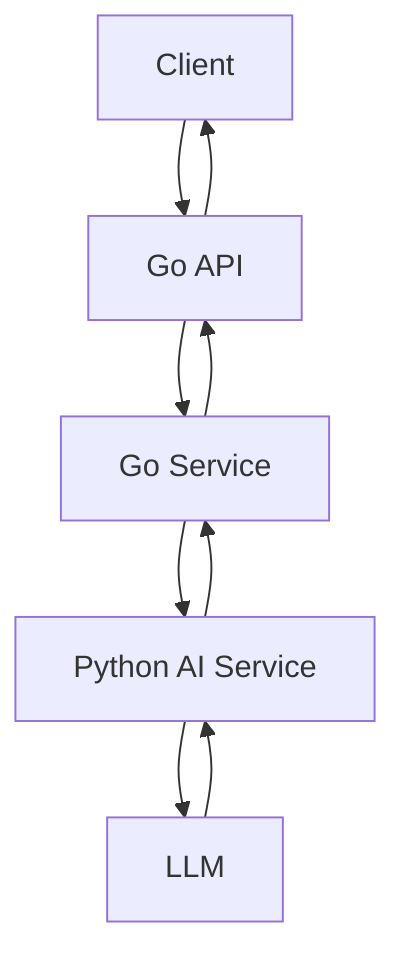

# Deep Project Architecture, Codebase Understanding & Engineering Review

I am going to provide you with the files of a software project that is currently **in active development and not yet complete**.

The project has a **Golang backend** and a separate **Python-based LLM/AI layer**. I want you to analyze the project as a software engineer reviewing an evolving system, not simply as a code reviewer.

Your primary objective is to develop a **deep, system-level understanding of the entire project** from the files I provide.

Do not rush into suggesting changes or rewriting code. First understand the system thoroughly.

---

# 1. First: Understand the Entire Project

Go through **all provided files carefully** before drawing conclusions.

Build a mental model of:

- What problem the project is trying to solve
- What the overall product/system is intended to become
- What has already been implemented
- What is currently being worked on
- What appears to be planned or implied by the existing architecture
- How the different components fit together
- Why the project is split between Go and Python
- What responsibilities belong to each language
- Where the boundaries between components currently exist
- What assumptions the existing implementation makes
- What parts are complete, partially complete, experimental, or placeholders

Do not assume that unfinished code is necessarily bad code. Distinguish between:

1. **Intentional incompleteness**
2. **Implementation gaps**
3. **Potential bugs**
4. **Architectural decisions**
5. **Temporary development choices**
6. **Things that genuinely need redesign**

If something is unclear from the files, explicitly say:

> "The codebase does not provide enough evidence to determine this."

Do not invent architecture or intentions that are not supported by the code.

---

# 2. Reconstruct the Current Architecture

Give me a detailed explanation of the architecture **as it currently exists**.

Explain:

- Major components
- Services
- Packages/modules
- Processes
- APIs
- Data flow
- Communication boundaries
- External dependencies
- LLM/AI components
- Storage/database components if present
- Configuration
- Authentication/authorization if present
- Error handling
- Logging
- Background processing
- Concurrency
- Networking
- Inter-process communication
- Any queues, workers, pipelines, or orchestration

Then explain why the architecture appears to be structured this way.

Do not merely describe folders. Explain the **engineering responsibilities and boundaries** represented by the structure.

---

# 3. Explain the Role of Go vs Python

This is particularly important.

## Go

Explain:

- What the Go application is responsible for
- Why Go is being used for those responsibilities
- What inputs it receives
- What processing it performs
- What outputs it produces
- What services/APIs it exposes
- How it communicates with Python
- How it handles concurrency
- How it handles errors
- How it manages resources
- What parts of the system Go effectively acts as the "orchestrator" or backend for

## Python

Explain:

- What the Python application is responsible for
- Why Python is being used for those responsibilities
- What AI/LLM processing occurs there
- How prompts are constructed
- How models are called
- How responses are processed
- Whether structured outputs are used
- Whether embeddings, retrieval, agents, tools, or other AI techniques are involved
- How Python receives information from Go
- How Python returns information to Go
- Whether the Python layer is acting as a service, worker, library, pipeline, or something else

Then explain:

### Why does this Go/Python split make sense?

Also identify:

- Where the boundary between Go and Python is
- What protocol/mechanism connects them
- What data crosses that boundary
- The format of that data
- Which component owns each responsibility
- Whether the boundary is clean or becoming coupled
- What could become problematic as the project grows

---

# 4. Create a Complete Current System Flow

Trace the system **from the moment an input enters the application until the final result is produced**.

Reconstruct the actual flow based on the code.

Show the flow in two forms:

### A. Human-readable explanation

Explain the complete lifecycle step by step.

### B. Architecture/data-flow diagram

Use Mermaid where appropriate.

For example:



Replace this with the **actual architecture discovered from the code**.

Also explain the data being passed at every major boundary.

---

# 5. File-by-File Wiring

I want an extremely detailed mapping of how the files currently connect.

## Go

For each significant Go file explain:

- What this file is responsible for
- Its package
- Important structs/types
- Important functions/methods
- What calls these functions
- What functions it calls
- What data enters the file
- What data leaves the file
- Dependencies
- External dependencies
- Relationship with other Go files
- Relationship with the Python layer
- Important engineering concepts demonstrated
- Potential risks/problems
- Whether the responsibility belongs in this file/package
- What I should understand from this file as a beginner engineer

Do this for **every significant Go file**.

## Python

Perform the same analysis for every relevant Python file.

For each Python file explain:

- What this file is responsible for
- Its module/package
- Important classes/functions
- What calls them
- What they call
- Inputs
- Outputs
- Dependencies
- LLM/model interactions
- Prompt-related logic
- Data transformations
- Relationship with other Python files
- Relationship with Go
- Important engineering concepts
- Potential risks/problems
- Whether the responsibility belongs there
- What I should learn from this file

---

# 6. Build a Dependency/Wiring Map

Create a concise but detailed map showing how the files connect.

For example:

```text
Go File A
   ↓ calls
Go File B
   ↓
Go File C
   ↓ HTTP/IPC/etc.
Python File A
   ↓
Python File B
   ↓
LLM
   ↓
Python File C
   ↓
Go File D
```

Use the **actual project files and relationships**.

Where possible, identify the actual function/method responsible for each connection.

---

# 7. Security Review

Perform a serious security review of the codebase.

Do not simply give generic security advice.

Identify what the project is already doing correctly.

Then identify concrete security risks based on the actual implementation.

Analyze areas such as:

- Authentication
- Authorization
- Input validation
- Input sanitization
- Injection risks
- Prompt injection
- LLM-specific security risks
- API security
- Secrets/API keys
- Environment variables
- Configuration
- HTTP security
- TLS
- CORS
- Request validation
- File handling
- Path traversal
- Command execution
- SQL injection
- SSRF
- Deserialization
- Dependency risks
- Error information leakage
- Logging sensitive information
- Rate limiting
- Abuse prevention
- Resource exhaustion
- Denial-of-service risks
- Authentication between Go and Python
- Trust boundaries between services
- Untrusted repository/code content if the project analyzes repositories
- Malicious or adversarial input passed to the LLM
- LLM-generated output being trusted by downstream components

For every finding classify it as:

- **Good practice already present**
- **Potential concern**
- **Actual vulnerability/risk**
- **Not applicable**

For actual risks, explain:

1. What the risk is
2. Where it exists
3. Why it matters
4. How an attacker could potentially exploit it
5. How it could be mitigated

Do not exaggerate theoretical risks. Clearly distinguish practical risks from hypothetical ones.

---

# 8. Efficiency and Performance Review

Analyze the implementation for efficiency.

## Go

Look at:

- Goroutines
- Channels
- Context usage
- Blocking operations
- HTTP clients
- Connection reuse
- Memory allocation
- File I/O
- CPU-intensive operations
- Concurrency
- Synchronization
- Potential race conditions
- Goroutine leaks
- Timeouts
- Retries
- Resource cleanup

## Python

Look at:

- LLM calls
- Synchronous vs asynchronous operations
- API calls
- Token usage
- Prompt size
- Repeated processing
- Caching
- Memory usage
- CPU-heavy processing
- Parallelism
- I/O
- Model invocation efficiency

## System level

Analyze:

- Number of network hops
- Go ↔ Python communication overhead
- LLM latency
- Database access
- Repeated computation
- Redundant API calls
- Scalability bottlenecks
- Potential single points of failure

Tell me what is already efficient and what may become inefficient as the system grows.

Do not prematurely optimize. Distinguish:

> "This is inefficient now"

from:

> "This is acceptable now but could become a bottleneck at scale."

---

# 9. Architecture & Design Patterns

Identify the actual software engineering patterns present in the code.

For each pattern explain:

- The name of the pattern
- Where it appears
- What problem it solves
- Why it is useful
- How it is implemented here
- Whether the implementation is appropriate
- What I should learn from it

Potential examples include, but do not assume they exist:

- Layered architecture
- Clean architecture
- Hexagonal architecture
- Dependency injection
- Repository pattern
- Service layer
- Adapter pattern
- Factory pattern
- Strategy pattern
- Middleware
- Pipeline architecture
- Client-server architecture
- Microservice architecture
- Event-driven architecture
- Worker pattern
- Producer-consumer
- Fan-out/fan-in
- Orchestration
- Separation of concerns
- Single responsibility
- Interface-based design
- Dependency inversion
- Context propagation
- Retry pattern
- Circuit breaker
- Bulkhead pattern

Only identify patterns that are actually supported by the code.

Also identify **anti-patterns or architectural smells** where appropriate.

---

# 10. Important Go Concepts I Should Learn

I have approximately **6–9 months of software engineering experience** and I am still developing my Go expertise.

Use this codebase as a teaching opportunity.

Identify the Go concepts that are particularly important for me to understand.

For each important concept:

1. Show where it appears in this project
2. Explain what it is
3. Explain why it is being used
4. Explain what could go wrong if misunderstood
5. Explain why it matters in production software

Prioritize concepts that genuinely strengthen my software-engineering foundation.

---

# 11. Important Python Concepts I Should Learn

Do the same for the Python side.

Focus on concepts relevant to:

- Backend engineering
- AI engineering
- LLM applications
- Service communication
- API clients
- Data processing
- Async programming
- Type hints
- Classes
- Modules
- Dependency management
- Error handling
- Testing
- Configuration
- Environment variables
- Serialization
- Structured data
- LLM integration
- Prompt engineering
- Structured output
- AI pipelines
- Retrieval if present
- Tool calling if present

Relate every concept to the actual code.

---

# 12. Important AI/LLM Engineering Concepts

Because this project contains an LLM layer, identify the AI engineering concepts demonstrated by the project.

Explain concepts such as:

- LLM integration
- Prompt construction
- Context management
- Token efficiency
- Structured outputs
- Model selection
- Model abstraction
- Hallucination risks
- Prompt injection
- Context windows
- Retrieval
- Embeddings
- RAG
- Tool use
- Agents
- Multi-step AI pipelines
- Determinism
- Temperature
- Evaluation
- Observability
- AI reliability
- Guardrails
- Validation of model output
- Human-in-the-loop
- Model failure handling

Only discuss concepts actually relevant to what the code is doing or what the architecture clearly intends to support.

---

# 13. Software Engineering Lessons

Identify the software engineering lessons I should carry into future projects.

Explain lessons around:

- Dividing responsibilities
- Designing service boundaries
- Deciding where logic belongs
- Keeping components loosely coupled
- Designing APIs between services
- Managing dependencies
- Designing for failure
- Handling external services
- Designing observability
- Making systems testable
- Thinking about security from the beginning
- Reasoning about scalability
- Avoiding premature optimization
- Structuring an evolving codebase
- Making architectural decisions deliberately

Tell me which lessons this project is already teaching me.

---

# 14. What I Did Right

Create a section called:

## What You Have Done Well

Identify concrete good decisions in the current implementation.

For each one explain:

- What was done
- Why it is good
- What engineering principle it demonstrates
- Why this is valuable for someone early in their software-engineering career

Do not give generic praise.

Base everything on the actual code.

---

# 15. What Needs Attention

Create a section called:

## What Needs Attention

Separate findings into:

### Critical
Things that could seriously affect correctness, security, reliability, or architecture.

### Important
Things that should be addressed before the project becomes significantly larger.

### Improvement
Things that are currently acceptable but could be improved.

### Future consideration
Things that do not need to be solved now but are worth understanding.

Do not overwhelm me with minor stylistic suggestions.

Prioritize issues according to their actual impact.

---

# 16. What Should NOT Be Changed Yet

This is important because the project is unfinished.

Identify things that are currently acceptable and **should not be unnecessarily refactored yet**.

Tell me where I might be tempted to over-engineer the project.

For example:

- Introducing unnecessary abstractions
- Creating too many interfaces
- Splitting services prematurely
- Adding unnecessary microservices
- Optimizing before measuring
- Adding complex AI agents where a simple pipeline works
- Adding infrastructure that the current scale does not require

Help me understand the difference between:

> "This architecture needs fixing"

and:

> "This architecture is simple because the project is still small."

---

# 17. Current State vs Intended State

Create:

## Current State

What the system can do right now.

## Apparent Intended State

What the architecture appears to be building toward.

## Missing Pieces

What is currently incomplete.

## Technical Debt

What has been deliberately simplified or deferred.

## Architectural Risks

What could become difficult to change later if the current direction continues.

Make it clear when something is an inference rather than an explicit implementation.

---

# 18. Recommended Development Direction

After fully understanding the project, propose a **logical development sequence** for completing it.

Do not rewrite the entire project.

Instead give me a staged roadmap based on the actual current state.

For example:

```text
Stage 1 — Finish X
Stage 2 — Test Y
Stage 3 — Connect Z
Stage 4 — Add security
Stage 5 — Add observability
Stage 6 — Evaluate AI output
Stage 7 — Performance improvements
Stage 8 — Production hardening
```

For every stage explain:

- Why it comes at that point
- What depends on it
- What engineering concept I will learn
- What should be tested before moving on

---

# 19. Beginner-Friendly Deep Explanation

Although I want a professional engineering analysis, explain important concepts at a level suitable for someone with approximately **6–9 months of software engineering experience**.

Do not dumb things down.

Instead:

1. Explain the concept simply
2. Show how this project uses it
3. Explain the deeper engineering reason
4. Explain how the concept appears in production systems

I want to understand **why**, not just **what**.

---

# 20. Final Engineering Mental Model

End the analysis with:

# The Mental Model You Should Take Away

Explain the project as if you were teaching me how to think about software systems rather than teaching me how to memorize the code.

Answer:

- What is the system fundamentally doing?
- What are its major boundaries?
- Where does data enter?
- Where does data change?
- Where does trust change?
- Where does computation happen?
- Where does AI happen?
- Where can things fail?
- Where can things become slow?
- Where can security problems appear?
- Which component owns which responsibility?
- How does Go contribute to the system?
- How does Python contribute?
- How does the LLM fit into the overall architecture?
- What engineering principles are demonstrated?
- What should I carry into my next backend project?
- What should I carry into my next AI project?

Then give me **10–15 key engineering lessons from this project that I should remember throughout my career**.

---

# IMPORTANT ANALYSIS RULES

Follow these rules throughout the analysis:

### 1. Understand before criticizing

Do not criticize a piece of code before understanding its purpose in the larger architecture.

### 2. Do not assume the project is finished

This is an active project.

Evaluate the implementation according to its current stage.

### 3. Separate facts from recommendations

Clearly distinguish:

- "The code currently does X."
- "This could cause Y."
- "A possible improvement would be Z."

### 4. Trace actual code

Whenever possible, reference:

- File
- Function
- Struct/class
- Package/module
- API endpoint
- Communication boundary

Do not make vague statements.

### 5. Do not rewrite everything

The objective is **understanding first**, not replacing the implementation.

### 6. Do not optimize prematurely

Only recommend optimization when there is a meaningful reason.

### 7. Look at the system as a whole

Do not review Go and Python independently.

Understand how the two systems work together.

### 8. Treat AI as a software component

Do not treat the LLM as magic.

Analyze, where applicable:

```text
Input
→ preprocessing
→ context construction
→ model call
→ model output
→ validation
→ post-processing
→ downstream action
```

### 9. Identify uncertainty

If the repository does not provide enough evidence, explicitly state what cannot be determined.

### 10. Teach me while analyzing

This project is part of my development as a software engineer.

Whenever you identify an important concept, explain **why I should care about it**.

---

# REQUIRED OUTPUT STRUCTURE

Organize your final response around these major sections:

1. **Executive Summary**
2. **What the Project Is Trying to Achieve**
3. **Current Project State**
4. **High-Level Architecture**
5. **Go vs Python Responsibilities**
6. **Complete System/Data Flow**
7. **Go File-by-File Analysis**
8. **Python File-by-File Analysis**
9. **Go ↔ Python Wiring**
10. **Dependency Map**
11. **Security Review**
12. **Efficiency & Performance Review**
13. **Architecture & Design Patterns**
14. **Go Concepts I Should Learn**
15. **Python Concepts I Should Learn**
16. **AI/LLM Engineering Concepts**
17. **What You Have Done Well**
18. **What Needs Attention**
19. **What Should NOT Be Changed Yet**
20. **Current State vs Intended State**
21. **Recommended Development Roadmap**
22. **Software Engineering Lessons**
23. **The Mental Model You Should Take Away**
24. **Top 10–15 Career-Level Engineering Lessons**

At the end, provide a concise:

## One-Page Architecture Cheat Sheet

```text
Project purpose:
        ↓
Main components:
        ↓
Go responsibility:
        ↓
Python responsibility:
        ↓
LLM responsibility:
        ↓
Data flow:
        ↓
Service boundaries:
        ↓
Main security boundaries:
        ↓
Main performance considerations:
        ↓
Key architectural patterns:
        ↓
Current biggest gap:
        ↓
Next logical development step:
```

The goal is that after reading your analysis, I should be able to open this repository and explain to another engineer:

> "This is what the system does, this is why it is structured this way, this is what each component does, this is how Go and Python communicate, this is how data moves through the system, these are the security and performance considerations, and these are the software-engineering principles I am learning from building it."

Do not start by suggesting changes.

**First understand the entire codebase and reconstruct the system. Then analyze it.**
